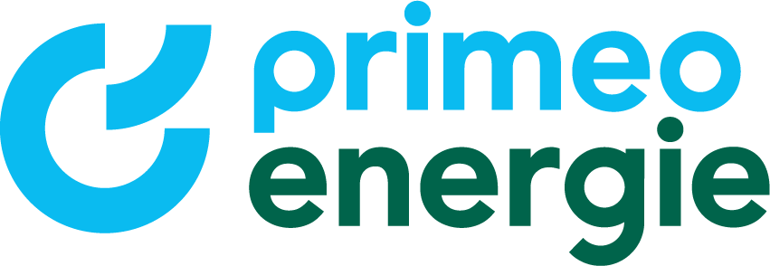

=   Systemidee Projekt Strom Bewusst

== Kernaufgabe des Systems
****
Ziel des Projektes Strom Bewusst ist es, ein Spiel für das Erlebniscenter Kosmos von Primeo Energie zu schaffen. Das Spiel soll Kindern näherbringen wie viel Strom im Alltag verbraucht wird - oft auch ohne dass es uns bewusst ist - und Tipps zum Stromsparen vermitteln.
****

== Kategorie von System
****
Unser Projekt ist ein operationales System, jedoch ohne externe Schnittstellen. Ausserdem hat unser System einige Eigenschaften eines Eingebetteten Systems, da wir spezielle Hardware und Peripherie verwenden werden.
Abhängig von der Spielidee für welche wir uns entscheiden werden wird unser System auch Eigenschaften eines Simulationssystemes besitzen.
****

== Wesentliche Qualitätsanforderungen
****
Unser Team hat folgende Qualitätsanforderungen (nach https://de.wikipedia.org/wiki/ISO/IEC_9126[DIN/ISO 9126]) als besonders wichtig für das System identifiziert:

* **Benutzbarkeit**, insbesondere Erlenbarkeit und Attraktivität
  Wichtig weil das Projekt unsere Zielgruppe fesseln soll
* **Zuverlässigkeit**, insbesondere Fehlertoleranz
  Wichtig weil der administrationsaufwand für Primeo Energie möglichst klein sein soll
* **Funktionalität**, insbesondere Angemessenheit
  Wichtig weil wir sicherstellen wollen, dass unser System für die Ausstellung der Primeo Energie geeignet ist

Es gibt ausserdem einige Qualitätsanforderungen die für unser Projekt weniger relevant sind, namentlich Sicherheit, da das System weder Schnittstellen auf externe Systeme hat, noch speziell schützenswerte Daten verarbeitet werden, Übertragbarkeit, da unser System einen spezialisierten Anwendungsfall hat und einzigartig sein wird und Effizienz, da diese auf das Spielerlebnis nur bedingt Einfluss hat.
****

== Relevante Stakeholder
****
Folgende Personen und Gruppen haben ein Interesse am System

**Auftraggeber:** +
Primeo Energie

Die Primeo Energie wird nach Projektabschluss das System in ihrer Ausstellung in Betrieb nehmen und administrireren.

**Kunden:**

* Cédric Merz
* Hannah Sarah Kühne

**Teammitglieder:**

* Andrin Martig
* Daniel Barber
* Samuel Burkhardt
* Damjan Mlinar
* Hoang Viet Nguyen
* Viktor Weilenmann
* Marco Worni

**Benutzer:** +
Zielgruppe sind 12 - 16 jährige Kinder welche die Ausstellung der Primeo Energie besuchen
****

== Schnittstellen zu externen Systemen
****
Das System ist in sich geschlossen. Es gibt keine Schnittstellen zu externen Systemen.
****

== Datenhaltung
****
Abhängig von der Spielidee für die wir uns entscheiden müssen Spieldaten wie z.B. High-Scores persistent gespeichert werden. Dafür werden wir gegebenenfalls eine SQLite Datenbank verwenden, so können wir uns die  Vorteile relationaler Datenbanken zunutze machen, ohne eine externe Schnittstelle erstellen zu müssen.
****
